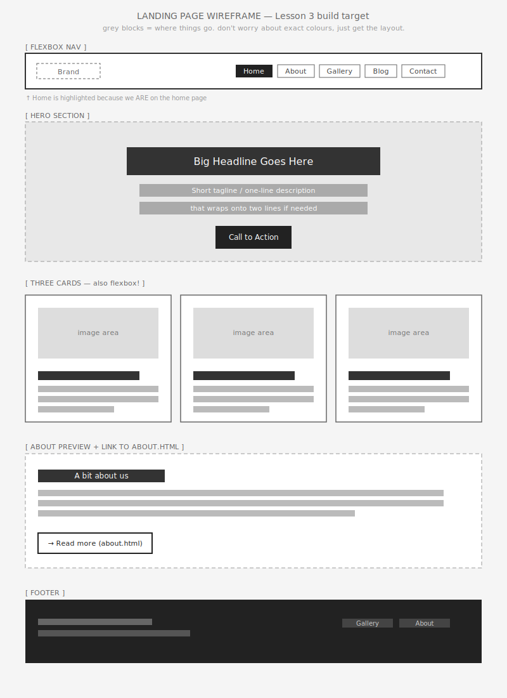

# Lesson 3: Build Your Landing Page

Today you'll build a multi-page website with a flexbox navigation bar. The fundamentals you learn here give you the skills to direct AI, recognise good code, and ask for what you want.

## What you're given

- [starter/index.html](https://github.com/MrBev02/CT_Web_Software/blob/main/lesson-3/starter/index.html) — your landing page. Has placeholder comments where things go. You'll fill it in.
- [starter/about.html](https://github.com/MrBev02/CT_Web_Software/blob/main/lesson-3/starter/about.html) and [starter/gallery.html](https://github.com/MrBev02/CT_Web_Software/blob/main/lesson-3/starter/gallery.html) — already built. The nav is in place. You just need to make sure the links to/from them work.
- [starter/styles.css](https://github.com/MrBev02/CT_Web_Software/blob/main/lesson-3/starter/styles.css) — has the basics. You'll add the nav and section styles.
- [wireframe.svg](wireframe.svg) — what you're aiming to build.
- [demo/flexbox-playground.html](demo/flexbox-playground.html) — your sandbox. Use it whenever you're not sure what a flexbox property does.
- [reference/flexbox.md](reference/flexbox.md) — the cheat sheet. Read it when you get stuck.

## Why we're hand-coding today

In the coming weeks you will use AI to build the bulk of your assessment site. Today's lesson gives you the knowledge to read what the AI writes, judge whether it's any good, and tell it what to change.


---


## Task order — do these in sequence

### ✅ Task 1 — Build the nav HTML *(about 5 min)*

Open `starter/index.html`. Find the NAV comment block. Add a `<nav class="main-nav">` with:

- A brand link on the left: `<a href="index.html" class="brand">Brand</a>`
- A `<div class="nav-links">` containing five `<a>` tags:
  - Home → `index.html` (give this one `class="active"`)
  - About → `about.html`
  - Gallery → `gallery.html`
  - Blog → `#`
  - Contact → `#`

Save and open the page in Live Server. The links will look like a vertical list — that's expected. You'll fix that with CSS next.

### ✅ Task 2 — Make the nav horizontal with flexbox *(about 5 min)*

Open `starter/styles.css`. Find the `.main-nav` rule. Add these four properties:

```css
.main-nav {
  display: flex;
  justify-content: space-between;
  align-items: center;
  gap: 24px;
}
```

Then do the same for `.nav-links` (it's also a flex container — flexbox inside flexbox is normal):

```css
.nav-links {
  display: flex;
  gap: 20px;
  align-items: center;
}
```

**Check before moving on:** Reload your page. The brand should be on the left, the links should be on the right, and they should all be on the same horizontal line. If not, check the cheat sheet's "Common things that break" section.

### ✅ Task 3 — Test the page-to-page links *(about 2 min)*

Click your "About" link. You should land on `about.html`. From there, click "Home" — you should come back. Click "Gallery" from About — you should land on the gallery page. Click "← Back to home" — back to index.

If any of these fail, the most likely cause is a typo in your href (e.g., `about.htm` instead of `about.html`).

### ✅ Task 4 — Translate the wireframe into the rest of the page *(about 13 min)*

Review the `wireframe.svg` above and look at the sections below the nav: hero, three cards, about preview, footer. Build them out in `index.html` using the comment blocks as guides.

You won't finish the whole page in this lesson — that's fine. **Aim for at minimum:** the hero section + the start of the cards. Style as you go in `styles.css`.

The cards section is *also* a flex container (`display: flex` on `.cards`, with `flex: 1` on each `.card` to make them share space equally). Try it.

---

## Self-check before calling the teacher over

Before you ask for help, work through this list:

- [ ] All three pages open in the browser without errors
- [ ] The nav appears horizontally (not vertically) on `index.html`
- [ ] Clicking each nav link goes to the right page (or stays on `#`)
- [ ] You can explain what each of `display: flex`, `justify-content`, and `align-items` is doing on your nav

If something's broken and the cheat sheet hasn't helped, *then* call the teacher.

---

## End-of-lesson check

Before you pack up, your teacher will check:

1. You have three working files (`index.html`, `about.html`, `gallery.html`).
2. The nav lays out horizontally and clicking links navigates between pages.
3. Your landing page is in progress — the nav is done and you've started on the hero or cards.

You'll also be asked to **point at one line of CSS and explain what it's doing**. Be ready.

---

## Done early? Pick one of these.

### Option A — Polish your nav with hover states and active page

In `styles.css`, add:

```css
.main-nav a {
  color: #ddd;
  text-decoration: none;
  transition: color 0.2s;
}
.main-nav a:hover {
  color: white;
}
.main-nav a.active {
  color: white;
  border-bottom: 2px solid #f4a72a;
}
```

Then explore `flex-grow` and `flex-shrink` in the playground demo. Try giving one of the nav links `flex-grow: 1` — what happens? Why?

### Option B — Recreate the wireframe with AI, then compare

Open the wireframe. Prompt an AI assistant to build it (be specific: "build a landing page in HTML and CSS that matches this wireframe — it has a nav with a brand on the left and five links on the right, a centred hero with a heading and CTA button, three cards in a row, an about section, and a footer").

Compare what the AI produced to what you built by hand:

- Did it use flexbox? Where?
- What did it call its CSS classes? Are they similar to yours?
- What's *better* about the AI's version? What's *worse*?

Bring your comparison to next lesson — we'll talk about it.
